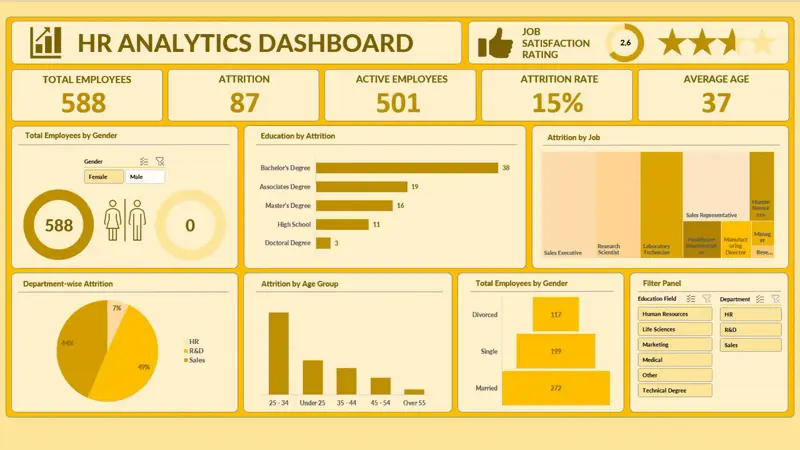
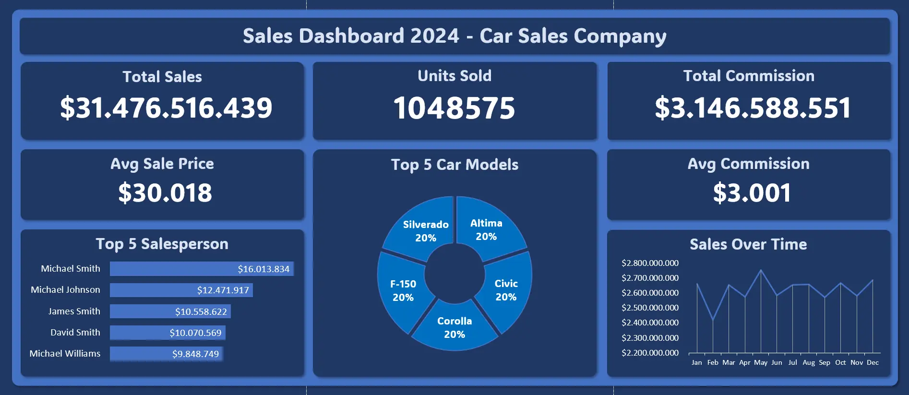
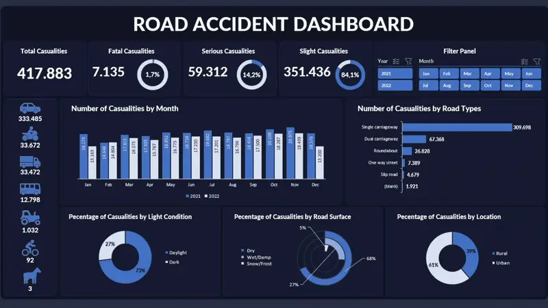

# Dirga Halim Susilo — Portfolio

[](https://github.com/8shagrid/dirga-portfolio/actions/workflows/deploy.yml)
[](https://nextjs.org/)
[](https://www.typescriptlang.org/)
[](https://dirgahalimsusilo.site/)

Production-ready personal portfolio for **Dirga Halim Susilo** — Data Analyst and Business Intelligence professional based in Medan, Indonesia.

**Live:** [dirgahalimsusilo.site](https://dirgahalimsusilo.site/)

## Overview

This portfolio positions Dirga as a Data Analyst who turns business questions into prepared data, clear analysis, interactive dashboards, and practical recommendations. Software engineering work remains visible as supporting evidence of strong technical delivery.

## Highlights

- Recruiter-focused hero with a clear Data Analyst and Business Intelligence position
- Three visual analytics case studies with business questions, KPIs, deliverables, tools, and repository links
- Supporting ETL, data collection, machine learning, and production product experience
- Responsive single-page experience with smooth anchor navigation
- Light/dark mode with persisted theme preference
- Centralized content management in `src/lib/data.ts`
- SEO metadata, Open Graph image route, sitemap, robots, and JSON-LD structured data
- ATS-friendly one-page resume generated from `scripts/generate_resume.py`

## Featured Analytics

| HR Analytics | Car Sales | Road Accident |
| --- | --- | --- |
|  |  |  |

## Supporting Product Screenshots

| SiapTempur | PejuangKampus |
| --- | --- |
|  |  |

| Seraya ERP | Seraya |
| --- | --- |
|  |  |

## Tech Stack

- **Framework:** Next.js 16 App Router
- **Language:** TypeScript
- **Styling:** Tailwind CSS 4
- **Animation:** Framer Motion
- **Icons:** Lucide React, React Icons
- **Hosting:** Vercel

## Project Structure

```txt
src/
  app/            Next.js App Router files, metadata, SEO routes
  components/     Portfolio sections and reusable UI components
  lib/            Central content data, animations, utilities
public/           Static assets, screenshots, CV, favicons
.github/          CI workflow
```

## Development

```bash
npm install
npm run dev
```

Open `http://localhost:3000`.

## Quality Checks

```bash
npm run lint
npm run build
```

## Content Updates

Most portfolio content lives in `src/lib/data.ts`:

- Hero role, positioning, tagline, stats, and location
- Analytics case studies, metrics, business questions, and links
- Supporting product/project descriptions and links
- Skills, experience, education, certifications
- Contact links and CV URL

## Resume

Regenerate the downloadable resume with:

```bash
python scripts/generate_resume.py
cp output/pdf/cv-dirga-halim-susilo.pdf public/cv-dirga-halim-susilo.pdf
```

## Deployment

The site is optimized for Vercel. Push to the connected GitHub repository and Vercel will build the Next.js app automatically.

## Author

**Dirga Halim Susilo**  
Portfolio: [dirgahalimsusilo.site](https://dirgahalimsusilo.site/)  
GitHub: [@8shagrid](https://github.com/8shagrid)
